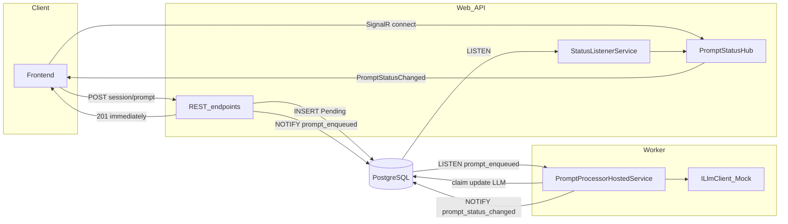
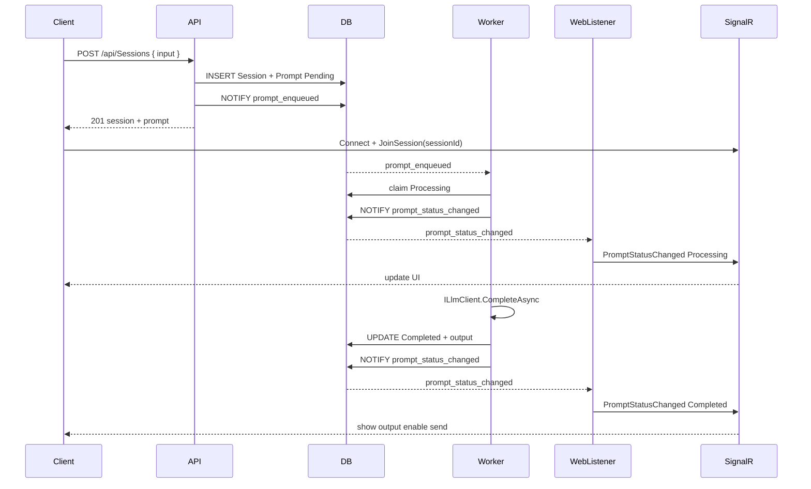
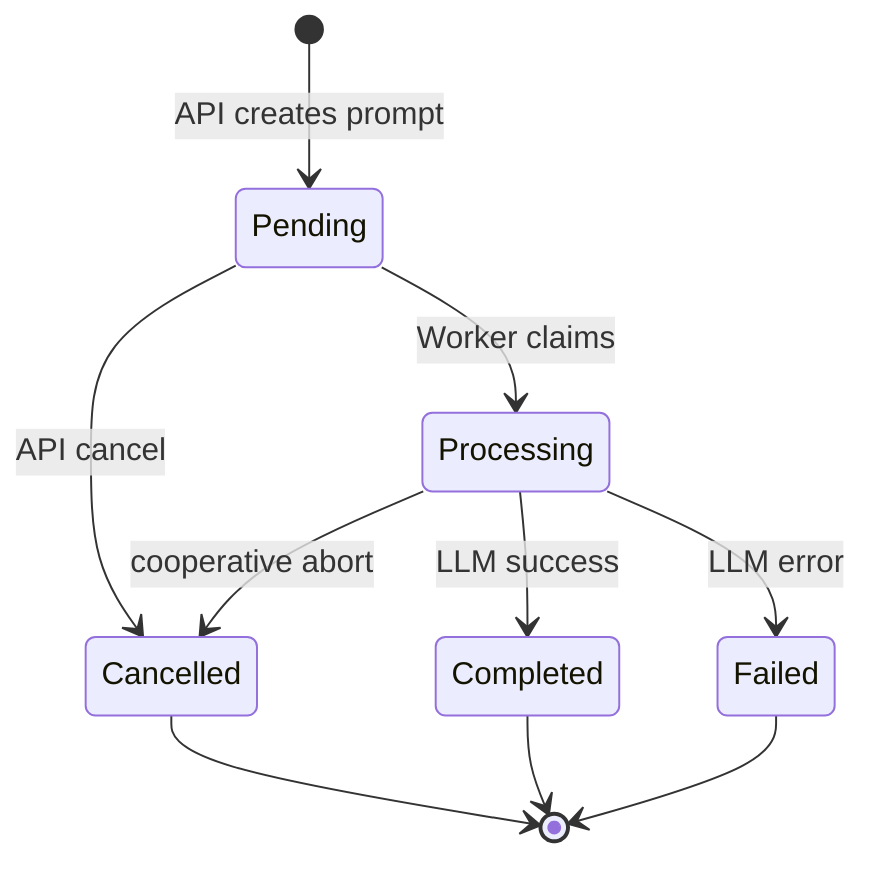

# API–Worker Integration

**Status:** design (authoritative)

## Overview

Promptify uses two backend processes sharing one PostgreSQL database:

| Process | Role |
|---------|------|
| **Web API** | HTTP + SignalR. Accepts prompts, enforces auth and session rules, pushes real-time updates to clients. |
| **Worker** | Background host. Claims `Pending` prompts, calls the LLM, updates status in DB, notifies Web of changes. |

Postgres is the **source of truth** for sessions, prompts, and status. There is no message broker in the default design.



## Core flow

```text
FE:    session idle? → POST prompt → 201
API:   transactional idle check + INSERT Pending + NOTIFY prompt_enqueued
Worker: claim → cancel check → LLM → update → NOTIFY prompt_status_changed
Web:   LISTEN → SignalR → FE re-enables send
```



## Design principles

1. **Early return** — API never waits for the LLM. `POST` persists the prompt and returns `201` with session + prompt metadata.
2. **Separate process** — Worker is a distinct executable (Generic Host), separate Docker container.
3. **Push, not poll (client)** — UI uses SignalR for status updates. No frontend polling.
4. **Push, not poll (worker)** — Worker wakes on `pg_notify('prompt_enqueued')`, not a `Task.Delay` loop over the DB.
5. **One in-flight prompt per session** — enforced by **API + FE**, not by worker FIFO logic.
6. **Cooperative cancellation** — Worker re-checks `Cancelled` before and after processing; cancelled prompts are hidden from list queries.

## Why not RabbitMQ?

RabbitMQ is valid but optional. For this project:

| Approach | Pros | Cons |
|----------|------|------|
| **Postgres + NOTIFY** (chosen) | No extra container; DB already required; event-driven wake-up | Tied to Postgres |
| **RabbitMQ** | Clear dispatch story; broker pushes to consumers | +1 service, more test/orchestration surface |
| **DB poll loop** (avoid) | Simple to write | Artificial latency; wasted queries |

RabbitMQ only replaces the **dispatch** wire (API → Worker). Worker still needs DB for persistence and status. Worker → Web → SignalR still needs a second bridge unless Web polls (which we avoid).

## Session sequencing (API / FE gate)

The worker does **not** enforce per-session ordering. The API and frontend do:

> A new prompt may only be submitted when the session has **no** prompts in `Pending` or `Processing`.

### API check (transactional)

```text
BEGIN
  IF EXISTS (prompt in session WHERE status IN (Pending, Processing))
    → 409 Conflict
  ELSE
    → INSERT prompt (Pending)
    → NOTIFY prompt_enqueued
COMMIT
```

### Frontend

- Disable send while the latest prompt is `Pending` or `Processing`.
- Re-enable on SignalR `Completed`, `Failed`, or `Cancelled`.

### Implications

- Worker claim query is simple: any `Pending` row, `FOR UPDATE SKIP LOCKED`.
- `OrderIndex` is for **display order** in chat history, not worker gating.
- Multiple **sessions** can process in parallel; only one active prompt per session.

## Prompt lifecycle



| Status | Set by | Visible in list API |
|--------|--------|---------------------|
| `Pending` | API on create | Yes |
| `Processing` | Worker on claim | Yes |
| `Completed` | Worker after LLM | Yes |
| `Failed` | Worker on error | Yes |
| `Cancelled` | API cancel (Pending only in v1) | **No** (filtered) |

## REST API (planned)

All endpoints require Bearer auth. Ownership via `Session.UserId == IUser.Id`.

| Method | Route | Behavior |
|--------|-------|----------|
| `POST` | `/api/Sessions` | Create session + first prompt. Body: `{ title?, input, data? }`. Returns `201`. |
| `POST` | `/api/Sessions/{sessionId}/prompts` | Append prompt. **409** if session not idle. Returns `201`. |
| `GET` | `/api/Sessions` | List current user's sessions. |
| `GET` | `/api/Sessions/{sessionId}` | Session + ordered prompts (`Cancelled` excluded). |
| `POST` | `/api/Prompts/{promptId}/cancel` | Cancel if `Pending`. **409** otherwise. |

### Create response (immediate)

```json
{
  "sessionId": 1,
  "title": null,
  "prompt": {
    "id": 42,
    "orderIndex": 0,
    "status": "Pending",
    "input": "Hello"
  }
}
```

Client uses `sessionId` to join the SignalR group and render the pending bubble.

## Worker processing flow

```text
1. LISTEN prompt_enqueued (blocked — no poll loop)
2. On NOTIFY → open scope → TryClaimNextAsync()
3. Re-read status → if Cancelled → stop
4. Set Processing, SaveChanges, NOTIFY prompt_status_changed
5. Call ILlmClient.CompleteAsync(input, cancellationToken)
6. Re-read status → if Cancelled → stop (do not write Completed)
7. Set Completed + Output (or Failed + ErrorMessage)
8. SaveChanges, NOTIFY prompt_status_changed
```

### Cancellation checks

| When | Action |
|------|--------|
| After claim, before LLM | If `Cancelled` → exit |
| During LLM | `CancellationToken` linked to optional status poll |
| After LLM, before save/notify | If `Cancelled` → do not publish success |

v1: API only allows cancel on `Pending`. Worker checks still defend against races.

## Postgres NOTIFY channels

| Channel | Publisher | Subscriber | Payload |
|---------|-----------|------------|---------|
| `prompt_enqueued` | **Web API** (after INSERT) | **Worker** | `{ "promptId": 42, "sessionId": 1 }` |
| `prompt_status_changed` | **Worker** (after status write) | **Web** | `{ "promptId": 42, "sessionId": 1, "status": "Processing" }` |

Subscribers use a **dedicated long-lived Npgsql connection** with `LISTEN` — not periodic table scans.

Reference: [`PromptStatusNotifier`](../backend/src/Infrastructure/Prompts/PromptStatusNotifier.cs) (today publishes `prompt_status_changed`; extend for enqueue from API).

## Worker → Web → SignalR bridge

Worker and Web are different processes. Worker **cannot** call `IHubContext` directly.

```text
Worker → pg_notify(prompt_status_changed) → Web LISTEN → SignalR → Client
```

### Web components

| Component | Responsibility |
|-----------|----------------|
| `PromptStatusHub` (`/hubs/prompts`) | Authenticated connections; `JoinSession(sessionId)` adds to group `session-{sessionId}` (ownership verified). |
| `PromptStatusListenerService` | `LISTEN prompt_status_changed`; load prompt from DB; `SendAsync("PromptStatusChanged", dto)`. |

### SignalR event: `PromptStatusChanged`

```json
{
  "promptId": 42,
  "sessionId": 1,
  "orderIndex": 0,
  "status": "Completed",
  "input": "Hello",
  "output": "Mock response to: Hello",
  "errorMessage": null
}
```

Terminal states include `output` / `errorMessage` so the client does not need a follow-up `GET`.

## Auth

- Identity Bearer tokens ([`Users` endpoint](../backend/src/Web/Endpoints/Users.cs)).
- Every session has `UserId`; all handlers filter by `IUser.Id`.
- SignalR: authenticated connection; `JoinSession` verifies session ownership.
- Worker uses a **system `IUser`** stub for audit fields (no HTTP user context).

## Configuration

```json
{
  "Llm": {
    "Provider": "Mock",
    "MockDelayMs": 2000
  }
}
```

Connection string: `PromptifyWebApiDb` (shared by Web and Worker).

## Orchestration

| Environment | Services |
|-------------|----------|
| Aspire AppHost | Postgres + Web + Worker |
| Docker Compose | `db` + `webapi` + `worker` |

See [06-orchestration.md](06-orchestration.md).

## Implementation checklist

### Web API

- [ ] CQRS: `CreateSession`, `CreatePrompt`, `GetSessions`, `GetSessionById`, `CancelPrompt`
- [ ] Session idle check (transactional `409`)
- [ ] `NOTIFY prompt_enqueued` after insert
- [ ] `Sessions.cs` / `Prompts.cs` endpoints with `RequireAuthorization`
- [ ] `PromptStatusHub` + `PromptStatusListenerService`
- [ ] `AddSignalR`, `MapHub`, CORS credentials for FE

### Worker

- [ ] Replace poll loop with `LISTEN prompt_enqueued`
- [ ] Simplify claim query (no FIFO SQL)
- [ ] Cancellation re-checks before/after LLM
- [ ] `NOTIFY prompt_status_changed` on Processing + terminal states
- [ ] Register system `IUser` for DI

### Tests

- [ ] Unit: session idle gate rejects second prompt while `Pending`
- [ ] Unit: cancel only on `Pending`
- [ ] Functional: POST → worker processes → DB `Completed`
- [ ] Functional: auth isolation (user A cannot read user B's session)
- [ ] Optional: SignalR integration test

## Manual smoke (Scalar / curl)

1. Register / login → Bearer token
2. `POST /api/Sessions` with `{ "input": "Hello" }` → `201`, note `sessionId`, `prompt.id`
3. Connect SignalR to `/hubs/prompts`, call `JoinSession(sessionId)`
4. Observe `Processing` then `Completed` with mock output
5. `POST /api/Sessions/{id}/prompts` while first still running → `409`
6. After completion, send second prompt → `201`
7. Cancel a `Pending` prompt → hidden from `GET`, never processed

## Related docs

- [Requirements](00-requirements.md)
- [App development](04-app-development.md)
- [Frontend](05-frontend.md)
- [Orchestration](06-orchestration.md)
