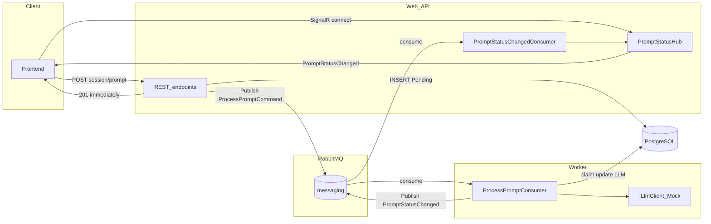
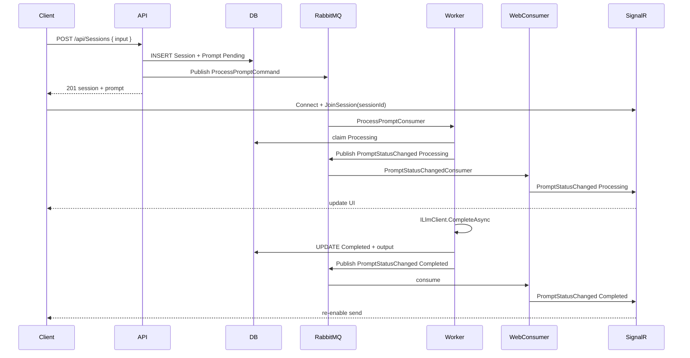

# API–Worker Integration

**Status:** implemented (MassTransit + RabbitMQ)

## Overview

Promptify uses two backend processes sharing one PostgreSQL database and a RabbitMQ message bus:

| Process | Role |
|---------|------|
| **Web API** | HTTP + SignalR. Accepts prompts, enforces auth and session rules, publishes dispatch commands, pushes real-time updates to clients. |
| **Worker** | MassTransit consumer host. Claims prompts by ID, calls the LLM, updates status in DB, publishes status events. |

Postgres is the **source of truth** for sessions, prompts, and status. RabbitMQ handles **dispatch** (API → Worker) and **completion notification** (Worker → Web → SignalR).



## Core flow

```text
FE:     session idle? → POST prompt → 201
API:    transactional idle check + INSERT Pending + Publish ProcessPromptCommand
Worker: consume → cancel check → claim Processing → LLM → Completed/Failed → Publish PromptStatusChanged
Web:    consume PromptStatusChanged → SignalR → FE re-enables send
```



## Session idle gate

The API enforces **one in-flight prompt per session** (no `Pending` or `Processing` before a new prompt is accepted). This replaces FIFO ordering in the worker — the API is responsible for ordering; the worker claims by explicit `PromptId` from the message.

| Check | Where |
|-------|-------|
| Session ownership | `SessionAccess.GetOwnedSessionAsync` |
| Session idle | `SessionAccess.EnsureSessionIdleAsync` → `409 Conflict` |
| Cancel | `Pending` only → `Cancelled` + optional status publish |

## Message contracts

Defined in `backend/src/Shared/Messaging/`:

```csharp
// API → Worker
public record ProcessPromptCommand(int PromptId, int SessionId);

// Worker → Web
public record PromptStatusChanged(
    int PromptId, int SessionId, int OrderIndex,
    string Status, string Input, string? Output, string? ErrorMessage);
```

Connection string key: `ConnectionStrings:messaging` (`Services.Messaging` constant).

## MassTransit wiring

- `Infrastructure/Messaging/MassTransitExtensions.cs` — shared `AddPromptifyMessaging` with RabbitMQ host + retry
- **Web** — registers `PromptStatusChangedConsumer`, `AddSignalR()`, `MapHub<PromptStatusHub>("/hubs/prompts")`
- **Worker** — registers `ProcessPromptConsumer`, `SystemUser` for audit DI

## REST API

| Method | Route |
|--------|-------|
| `POST` | `/api/Sessions` |
| `POST` | `/api/Sessions/{sessionId}/prompts` |
| `GET` | `/api/Sessions` |
| `GET` | `/api/Sessions/{sessionId}` |
| `POST` | `/api/Prompts/{promptId}/cancel` |

## SignalR hub

- Hub: `/hubs/prompts`
- `[Authorize]` — clients must authenticate
- `JoinSession(int sessionId)` — verifies ownership, adds connection to `session-{sessionId}` group
- Event: `PromptStatusChanged` (payload matches `PromptStatusChanged` message)

## Orchestration

| Environment | Command |
|-------------|---------|
| Local dev (Aspire) | `make apphost` — Postgres + RabbitMQ + Web + Worker |
| Docker | `make docker-up` — compose stack with RabbitMQ management on `:15672` |
| Tests | `make test` |

Aspire AppHost adds RabbitMQ with management plugin and wires `ConnectionStrings__messaging` into Web and Worker automatically.

## Reliability

- **At-least-once delivery** — consumers are idempotent (`Status != Pending → return`)
- **Publish after commit** — acceptable for v1; transactional outbox is a stretch goal
- **Retries** — `UseMessageRetry` with 1s / 5s / 15s intervals
- **Worker down** — messages accumulate in RabbitMQ; no artificial poll delay

## Removed (previous design)

| Removed | Replaced by |
|---------|-------------|
| `PromptProcessorHostedService` poll loop | `ProcessPromptConsumer` |
| `PromptStatusNotifier` (`pg_notify`) | `Publish<PromptStatusChanged>` |
| FIFO claim SQL | `ClaimPromptById(promptId)` |
